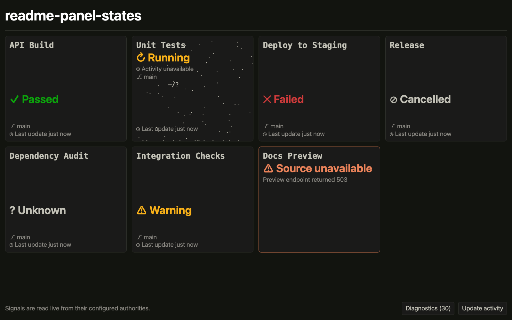

# Ze Great Dashboard

[](https://github.com/robertfmurdock/ze-great-dashboard/actions/workflows/main.yml)
[](https://github.com/robertfmurdock/ze-great-dashboard/pkgs/container/ze-great-dashboard)
[](https://www.npmjs.com/package/@continuous-excellence/ze-great-dashboard-aws)
[](https://socket.dev/npm/package/@continuous-excellence/ze-great-dashboard-aws)
[](https://www.npmjs.com/package/@continuous-excellence/ze-great-dashboard-client)
[](https://socket.dev/npm/package/@continuous-excellence/ze-great-dashboard-client)
[](LICENSE)

Ze Great Dashboard gives teams a large, visible answer to “are the things we rely on working now?”
It reads current engineering signals from their authorities and presents every status with a label,
glyph, and evidence.

[Explore the feature tour](docs/feature-tour.md) · [Try it locally](#quick-start) ·
[Deploy on AWS](#deploy-on-aws)

[](docs/assets/readme-status-vocabulary.png)

## Features

- GitHub Actions and GitLab CI pipeline status, plus incubating Azure DevOps Services support.
- Scalar text and small JSON-path values from HTTP endpoints.
- Independent polling, observation times, and links to source systems.
- Honest source-unavailable states, opt-in attention for urgent failures, and accessible status cues.
- OIDC authentication with fail-closed required mode.
- Stateless operation with no server-side observation history.

See the [feature tour](docs/feature-tour.md) for demos of status, attention, authentication, and
active pipelines.

## Quick start

### Docker

Run the included public example:

```sh
docker compose pull && docker compose up
```

Open <http://localhost:3000>.

To use your own `board.yaml`:

```sh
docker pull ghcr.io/robertfmurdock/ze-great-dashboard:latest
docker run --rm -p 3000:3000 \
  --mount type=bind,src="$PWD/board.yaml",dst=/app/boards/board.yaml,readonly \
  -e BOARD_CONFIG_URL=/app/boards/board.yaml \
  ghcr.io/robertfmurdock/ze-great-dashboard:latest
```

Pass credentials named by `token_env` separately, for example with `-e GITHUB_TOKEN`. Pin
`DASHBOARD_IMAGE` to a reviewed release tag for ongoing use; `latest` is intended for evaluation.

### From source

```sh
git clone https://github.com/robertfmurdock/ze-great-dashboard.git
cd ze-great-dashboard
npm install
npm run dev
```

Open <http://localhost:3000>. Set `BOARD_CONFIG_URL` to load another local board.

## Deploy on AWS

The
[`@continuous-excellence/ze-great-dashboard-aws`](https://www.npmjs.com/package/@continuous-excellence/ze-great-dashboard-aws)
package provides Lambda and ECS runtimes, deployment tooling, and CloudFormation templates. A
measured Lambda and HTTP API deployment projects to roughly **$0.80/month** for one always-open
wallboard in `us-east-1`; see the [feature tour](docs/feature-tour.md#operating-cost) for the sample
and assumptions.

Follow the [AWS deployment guide](docs/aws-setup.md) to bootstrap the administrator-owned boundary
and connect a protected gateway.

## Security

- Board YAML names credential environment variables; secret values stay in runtime secret handling.
- Browser-visible configuration contains public values only.
- `security: required` blocks dashboard pages and APIs when OIDC authentication is unavailable.
- Each viewer can export or clear the bounded diagnostic record held in their browser.

Read [OIDC authentication](docs/oidc-authentication.md) before exposing a dashboard beyond a trusted
local environment.

## Documentation

- [Feature tour](docs/feature-tour.md) — see status, attention, security, and active-work behavior.
- [Board configuration](docs/board-configuration.md) — define boards, panels, sources, and security.
- [AWS deployment](docs/aws-setup.md) — deploy and operate a private dashboard.
- [Server troubleshooting](docs/server-troubleshooting.md) — diagnose startup and panel failures.
- [Contributor guide](docs/contributing.md) — develop and test the project.

## Contributing

Contributions are welcome. Start with the [contributor guide](docs/contributing.md).

## License

[MIT](LICENSE)
