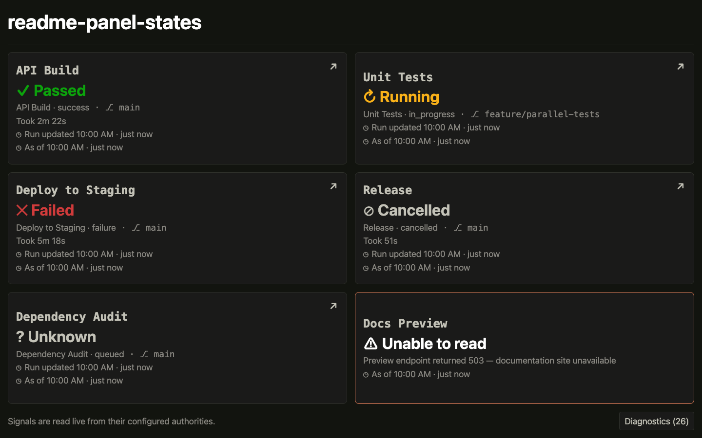
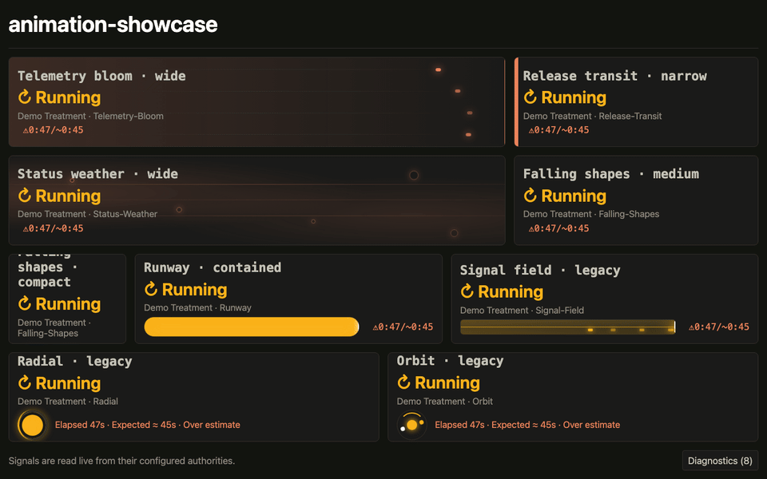

# Ze Great Dashboard

[](https://github.com/robertfmurdock/ze-great-dashboard/actions/workflows/main.yml)
[](https://www.npmjs.com/package/@continuous-excellence/ze-great-dashboard-aws)
[](https://socket.dev/npm/package/@continuous-excellence/ze-great-dashboard-aws)
[](https://www.npmjs.com/package/@continuous-excellence/ze-great-dashboard-client)
[](https://socket.dev/npm/package/@continuous-excellence/ze-great-dashboard-client)
[](LICENSE)

Ze Great Dashboard is a team-visible, stateless trust dashboard that reads current engineering
signals from their authorities: a lens, not a system of record.



The dashboard communicates seven states honestly: passed, warning, running, failed, cancelled,
unknown, and a source error. Status is never color alone; each state is paired with a glyph and a
readable label.



This preview shows the active pipeline treatments available on running pipeline panels.

It is for teams that want a big, visible answer to “are the things we rely on working now?” It is
not a metrics warehouse, historical analytics product, hosted SaaS, or a replacement for the systems
that own the underlying facts.

## What it can show

You can configure GitHub Actions `pipeline-status` panels and source-agnostic `http-value` panels
for scalar text or small JSON-path lookups. Panels poll independently, show when their reading was
observed, and report upstream failures instead of appearing healthy or blank.

GitHub Actions is supported, and Azure DevOps `pipeline-status` is supported but incubating.
Historical analytics, hosted-SaaS operation, and server-side persistence are intentionally outside
its scope.

## Get started

### Try it locally

Clone the repository, install its dependencies, and start the dashboard:

```sh
git clone https://github.com/robertfmurdock/ze-great-dashboard.git
cd ze-great-dashboard
npm install
npm run dev
```

Open <http://localhost:3000>. Vite runs on port 5173 and the application server on port 3000.

To use a local board other than the example, point the server at its YAML file:

```sh
BOARD_CONFIG_URL="$PWD/boards/ze-great-team.yaml" npm run dev
```

### Run it with Docker

With a `board.yaml` in the current directory, first pull the mutable evaluation tag, then run it:

```sh
docker pull ghcr.io/robertfmurdock/ze-great-dashboard:latest
docker run --rm -p 3000:3000 --mount type=bind,src="$PWD/board.yaml",dst=/app/boards/board.yaml,readonly -e BOARD_CONFIG_URL=/app/boards/board.yaml ghcr.io/robertfmurdock/ze-great-dashboard:latest
```

It serves the mounted board at <http://localhost:3000>. If the board names a source credential
such as `GITHUB_TOKEN` through `token_env`, pass it to Docker too (for example, `-e GITHUB_TOKEN`).

For the included example board, Compose needs no `.env` file:

```sh
docker compose pull && docker compose up
```

Compose uses `ghcr.io/robertfmurdock/ze-great-dashboard:latest` for evaluation. For an ongoing
deployment, set `DASHBOARD_IMAGE` to a reviewed exact release tag. `latest` is mutable, so pull it
explicitly before each evaluation. The selected immutable client remains independent of the server
image; override `ASSET_PATH` only when you intentionally select another valid client version. See
the [AWS deployment guide](docs/aws-setup.md) when you need to select a different client host or
version. Local source builds are covered by the
[contributor guide](docs/contributing.md).

### Local Azure DevOps access with Entra

**Experimental / incubating:** Azure DevOps Services boards can use your local Azure CLI login
without placing a PAT or Azure CLI profile in a container. See
[local Azure DevOps Entra access](docs/local-azure-devops-entra.md) for the host and Compose
configuration. This is interactive local development, not a deployed identity mechanism; it has no
live-tenant validation or compatibility promise.

### Deploy on AWS

The published [`@continuous-excellence/ze-great-dashboard-aws`](https://www.npmjs.com/package/@continuous-excellence/ze-great-dashboard-aws)
package contains the Lambda runtime, CLI, and CloudFormation template. Its default client source is
the matching immutable S3/CloudFront release; [`@continuous-excellence/ze-great-dashboard-client`](https://www.npmjs.com/package/@continuous-excellence/ze-great-dashboard-client)
is a separately published browser artifact for alternate CDNs. jsDelivr is a known alternative for
an exact client release; the
[AWS deployment guide](docs/aws-setup.md) walks a consumer-managed deployment from bootstrap
through a protected gateway and shows the pinned asset-path format.

## How it works

The browser loads a versioned client, while a small stateless server reads named signals through a
same-origin proxy. Board YAML describes what to show; it is not where credentials live.

```text
browser ──► stateless server ──► current signal authorities
   │             │
   │             └── reads board YAML and proxies named panel requests
   └── immutable, versioned client assets from CDN
```

The client assets are immutable and contain no environment-specific values. The server supplies the
entrypoint and public configuration at request time, so changing the selected client version does
not require rebuilding it.

## Trust and security principles

- No server-side persistence: the dashboard renders what the authority says now and keeps no ledger. A bounded diagnostic record remains only in each viewer's browser, is never uploaded, and can be exported or cleared by that viewer.
- Board YAML names credential environment variables; token values belong in runtime secret handling,
  never in YAML or source control.
- Browser-visible configuration is public-only. Secrets remain server-side.
- An unreadable panel reports an error honestly; it never quietly appears healthy or blank.

## Documentation

- [Board configuration](docs/board-configuration.md) — panel and source YAML schema.
- [AWS deployment](docs/aws-setup.md) — deploy a private Lambda after administrator bootstrap.
- [AWS bootstrap](docs/aws-bootstrap.md) — one-time setup for an AWS and GitHub administrator.

## Contributing

See the [contributor guide](docs/contributing.md) for local development and repository checks.

## License

[MIT](LICENSE)
