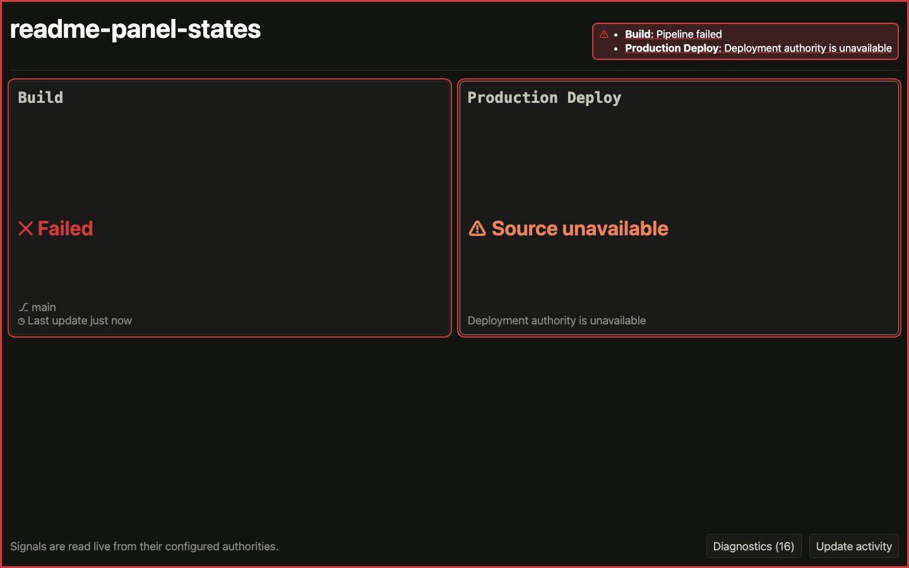
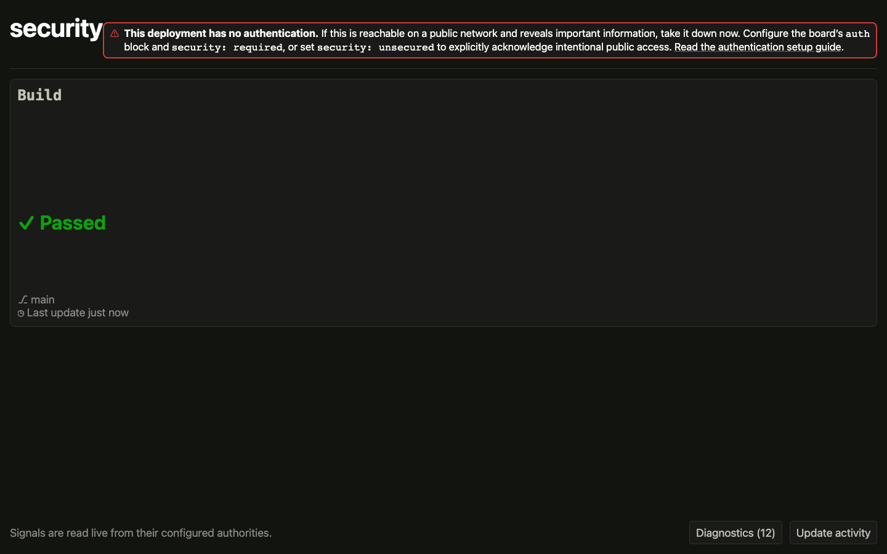
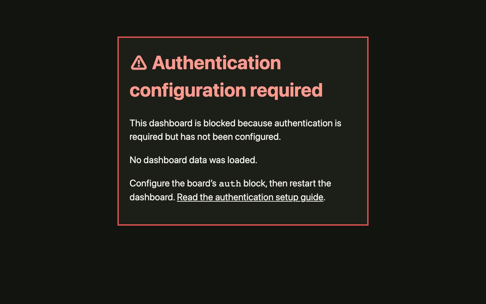

# Feature tour

Ze Great Dashboard presents current engineering signals for quick reading on a laptop or a shared
wall display. Panels identify their source, show when each reading was observed, and link to the
authority behind the status.

## Status at a glance

Pipeline panels support GitHub Actions, GitLab CI, and Azure DevOps Services. HTTP panels can show
scalar text or up to four small JSON-path values. Every state includes a glyph and readable label,
and an unreadable source reports its failure instead of appearing healthy or blank.

## Attention for important signals

Important panels can place urgent failures in an attention rail while preserving the full evidence
in the source panel. Reduced-motion preferences retain the same high-contrast static cue.

## Visible security posture

Deployments that permit unauthenticated access carry a persistent warning.

With `security: required`, unavailable or invalid OIDC configuration blocks the dashboard before it
loads board data. See [OIDC authentication](oidc-authentication.md) for provider setup and policy
options.

## Active pipelines

Running pipelines can use an active treatment while the status label and timing remain readable.
Treatments respect reduced-motion preferences and can be selected per panel.

## Operating cost

The live dashboard recorded 80,477 invocations from August 22–31, 2026, averaging 612 ms on a 256 MB
Arm Lambda. At current `us-east-1` rates, that projects to roughly **$0.80/month** for
[Lambda](https://aws.amazon.com/lambda/pricing/) and
[HTTP API Gateway](https://aws.amazon.com/api-gateway/pricing/), before account-wide free-tier
benefits or discounts. The smallest always-on ECS task (0.25 vCPU, 0.5 GB) is roughly **$9/month**
for [Fargate compute](https://aws.amazon.com/fargate/pricing/) alone.

The ECS figure excludes ingress and networking. The Lambda estimate represents one person's normal,
always-open wallboard use. Viewer count, source traffic, Region, and account pricing affect the
result.

## Next steps

- [Try the dashboard](../README.md#quick-start).
- [Configure a board](board-configuration.md).
- [Deploy on AWS](aws-setup.md).
